# AssetFlow

**AssetFlow** is an enterprise asset-management system: register and track physical assets, allocate them to employees or departments, resolve allocation conflicts through transfer requests, book shared resources on a conflict-free calendar, run an AI-assisted maintenance workflow, audit inventory against expected holders, and report on utilization and spend — all behind real session auth and role-based access control.

Built on Next.js 16, Prisma 6, and PostgreSQL, with Redis, Meilisearch, and S3-compatible object storage baked in as optional accelerators (never hard dependencies). There is intentionally no CI/CD, no test runner, no Husky, no lint-staged, and no commitlint — this project is optimized for fast local iteration: run the app, click through it, and use `pnpm lint`, `pnpm typecheck`, and `pnpm build` as your manual quality gate before committing.

> **Demoing this?** See [`docs/demo-script.md`](./docs/demo-script.md) for a 5-minute, screen-recording-ready walkthrough of every screen and its edge cases.

## Table of contents

- [Screens](#screens)
- [Feature tour](#feature-tour)
- [Architecture](#architecture)
- [Database design](#database-design)
- [Why these choices? (caching, search, indexing)](#why-these-choices-caching-search-indexing)
- [Stack](#stack)
- [Local setup](#local-setup)
- [Demo logins](#demo-logins)
- [Day-to-day commands](#day-to-day-commands)
- [Project structure](#project-structure)
- [Security model](#security-model)
- [Manual quality gates](#manual-quality-gates)

## Screens

| | |
| --- | --- |
| 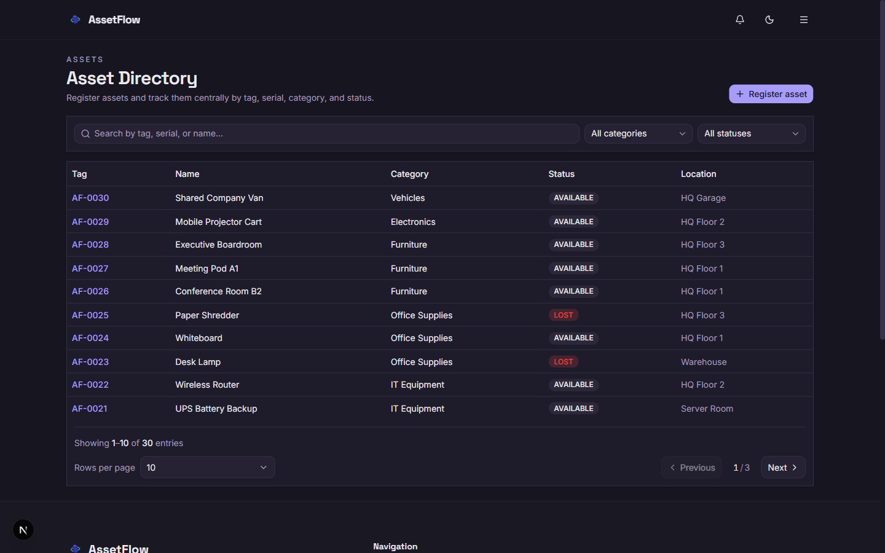 **Asset Directory** — search, filter, and register assets with auto-generated tags. | 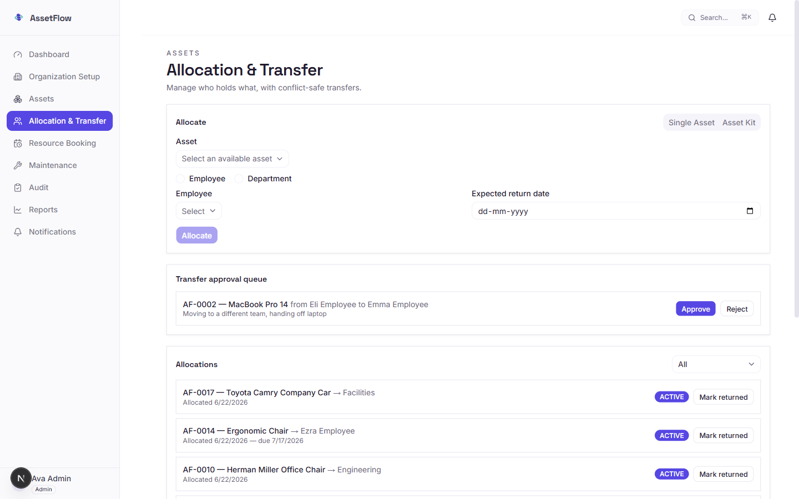 **Allocation & Transfer** — allocate to an employee or department; conflicts route straight into a transfer request. |
| 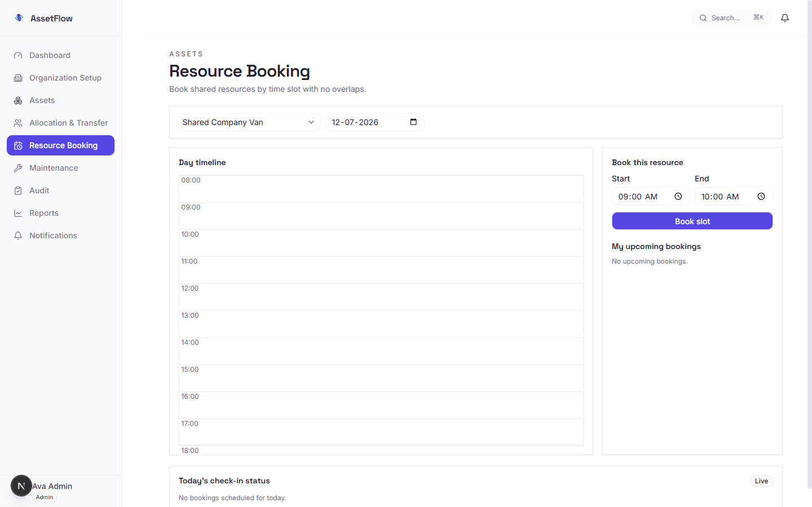 **Resource Booking** — day-timeline calendar with a live conflict preview before you submit. | 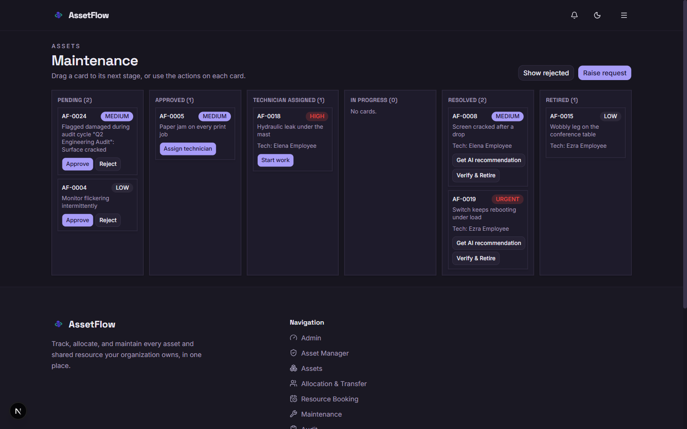 **Maintenance Kanban** — drag-and-drop board with AI retirement recommendations and a one-click Verify & Retire action. |
| 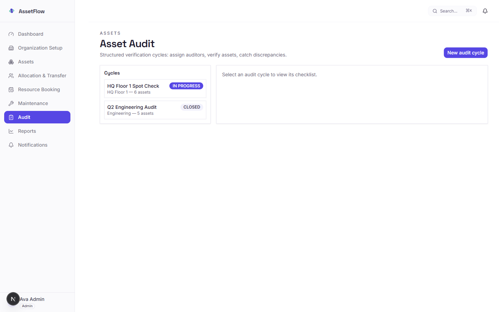 **Audit Cycles** — scope an audit, verify assets, auto-raise maintenance on damage. | 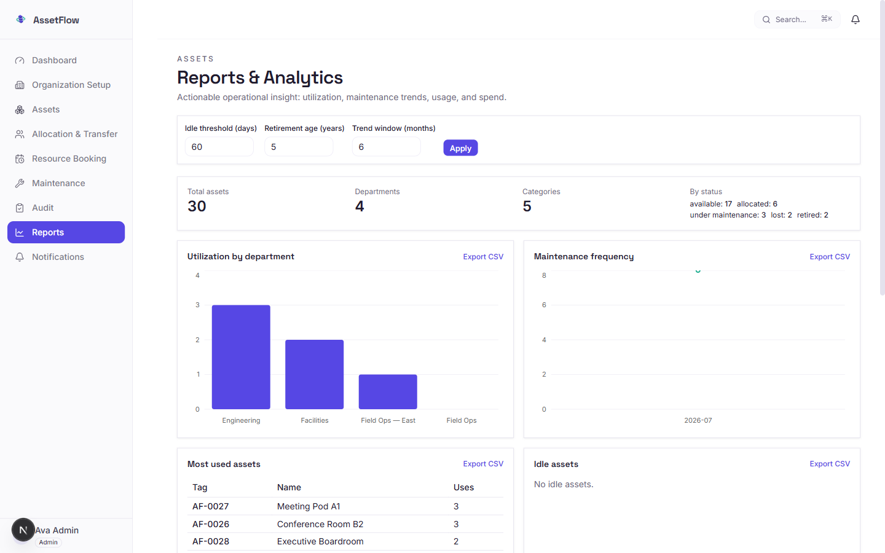 **Reports** — KPIs, charts, and compact-by-default tables with a Vercel-style expand toggle. |
| 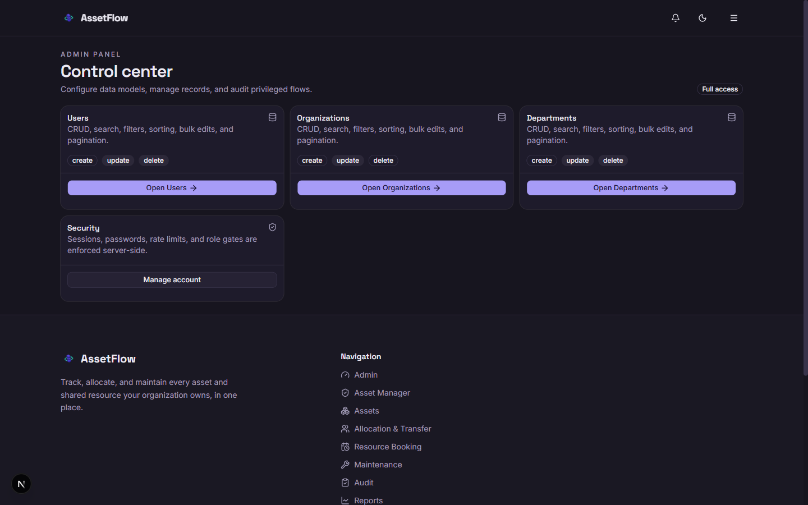 **Admin** — role management, org-wide entity control. | 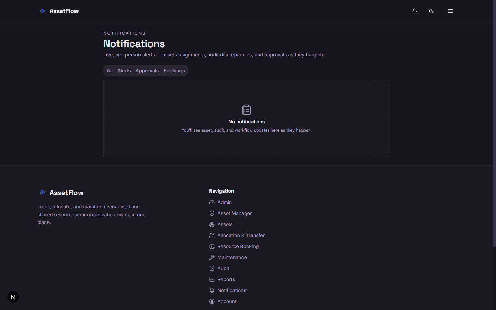 **Notifications** — live, categorized, pushed over SSE. |
| 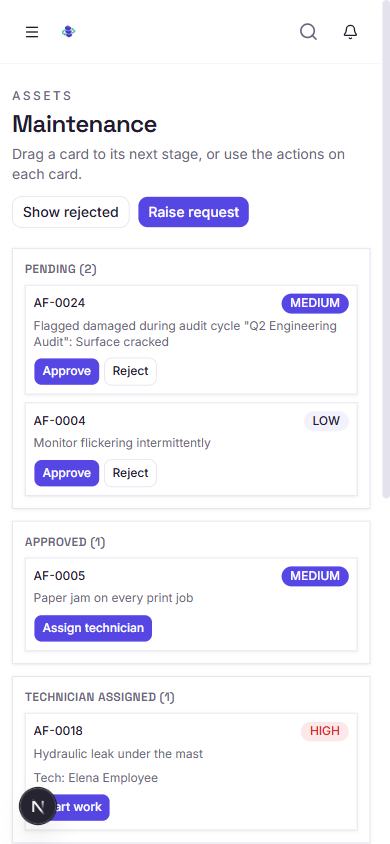 **Fully responsive** — the Kanban board (the hardest layout to shrink) at 390px wide. | 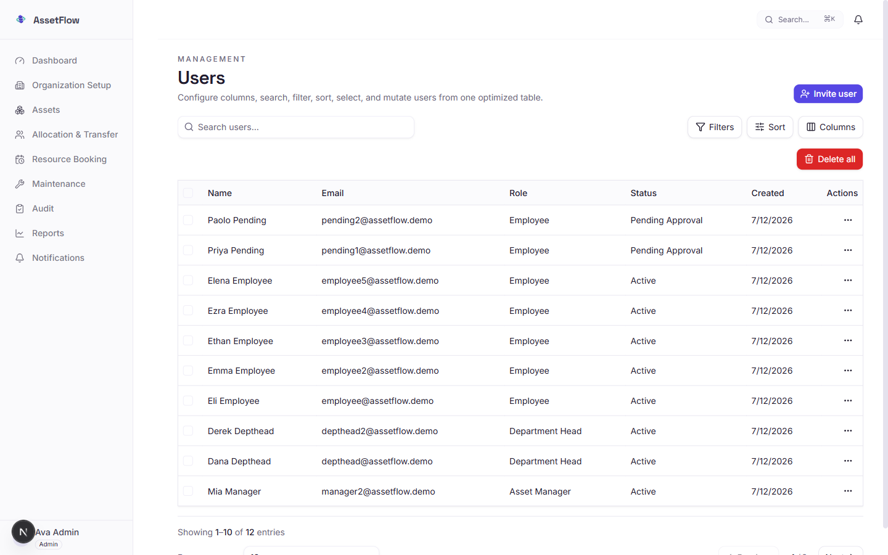 **Users** — the generic entity-CRUD engine, reused across Users/Organizations/Departments. |

## Feature tour

| Screen | What it does |
| --- | --- |
| **Auth** | Self-signup goes to `PENDING_APPROVAL` until an Admin approves it; an admin-issued invite auto-activates on password set (inviting a specific person *is* the vetting step). Session cookies are opaque random tokens, hashed at rest, `httpOnly`. |
| **Admin / Users** | Manage users, roles, and org/department membership; approve pending signups; invite new users by email (Nodemailer, console-mock if SMTP isn't configured). |
| **Asset Directory** | Register assets (auto-generated `AF-####` tags, race-safe under concurrent registration), category-specific custom fields, photo upload, full-text + fuzzy search, filter by category/status/department/location. |
| **Allocation & Transfer** | Allocate an asset to an employee or department; attempting to double-allocate surfaces a conflict banner naming the current holder, with a one-click transfer request instead of a raw error. Transfers are approved by a Department Head (scoped to their own department) or an Asset Manager/Admin. |
| **Resource Booking** | Book shared/bookable assets (meeting rooms, vehicles, equipment) on a day timeline with a live conflict preview; overlap is enforced by a Postgres GiST exclusion constraint, not just an app-layer check. |
| **Maintenance** | Drag-and-drop Kanban (Pending → Approved → Technician Assigned → In Progress → Resolved, plus a computed Retired column) built with `dnd-kit`. Resolving a request fires a non-blocking LLM call that evaluates acquisition cost, maintenance history, and the issue description, and flags assets worth retiring; a manager-only "Verify & Retire" action closes the loop by globally retiring the asset. |
| **Audit Cycles** | Scope an audit to a department or location, assign auditors, verify assets against expected holders, and auto-raise a maintenance request when an item is found damaged. |
| **Reports** | Org-wide KPIs, utilization by department, maintenance frequency, most-used/idle/near-retirement assets, spend by category, and a booking heatmap — Redis-cached with a short TTL, CSV export per section, tables compact-by-default with a Vercel-dashboard-style expand toggle per table. |
| **Notifications** | Per-user notification bell + panel (assignment/approval/booking/alert/info categories), pushed live over SSE via Redis pub/sub, backed by a durable Postgres table so nothing's lost if you weren't connected when it fired. |
| **Voice input** | Native Web Speech API dictation (mic button, live transcription, append-mode, graceful degradation with a toast when unsupported or denied) — built as one reusable hook + button, wired into the maintenance issue description and the asset-return condition notes. |

Role model: `ADMIN` (everything) > `ASSET_MANAGER` (assets/allocations/bookings/maintenance/reports, org-wide) > `DEPARTMENT_HEAD` (approvals scoped to their own department) > `EMPLOYEE` (self-service booking, raising maintenance, viewing their own allocations).

### In progress (teammate branches, not yet merged)

These are part of the product spec and actively being built by other contributors — listed here so the feature set is honestly complete, not because they're live in `main` yet:

- **Asset Kits (bulk allocation)** — reusable kits of multiple assets, allocated as one action; validates every asset is available before committing, blocks the whole operation and names the conflicting asset if not, and records allocation history per individual asset.
- **QR Code Search & Filtering** — a camera-based QR scanner in the Asset Directory (with proper permission handling) that populates the search bar and filters straight to the matching asset instead of typing a tag/serial by hand. (`feat/qr-code` on the remote — in progress.)
- **15-Minute Check-In & Auto-Release** — bookings require a check-in within 15 minutes of the start time, with a reminder and a 5-minute grace period, after which an uncompleted check-in auto-cancels the booking and releases the asset.
- **Ctrl+K Global Search** — a Meilisearch-powered command palette (`Ctrl`/`Cmd`+`K`) searching across assets, employees, departments, and other entities at once, with grouped results and full keyboard navigation.

## Architecture

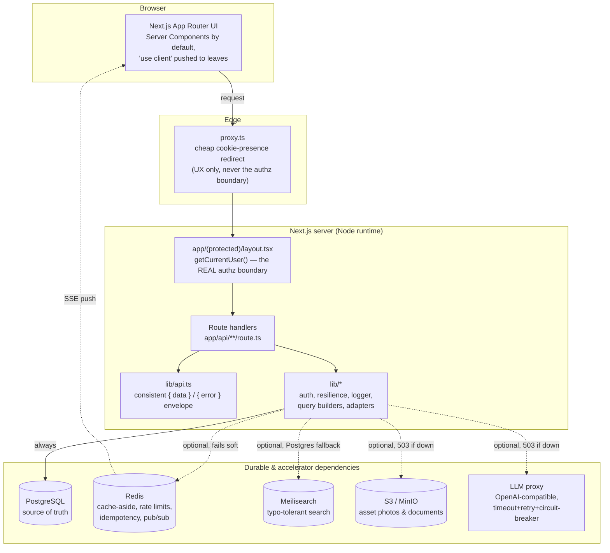

**The one rule that matters most**: only Postgres is a hard dependency. Every other box in that diagram — Redis, Meilisearch, S3, the LLM — is an accelerator with an explicit degrade path (see [Why these choices](#why-these-choices-caching-search-indexing) below). `proxy.ts` runs on the Edge runtime and does a cheap cookie-presence check for a fast redirect; it is **never** trusted as the real authorization boundary — every protected page and API route re-verifies the session against the database on every request.

## Database design

All 20 tables scoped under one multi-tenant root (`Organization`). UUIDv7 primary keys everywhere (sortable-enough, collision-resistant, don't leak sequential volume like an auto-increment int would), stored as native Postgres `uuid` columns rather than `text` for smaller storage and faster index comparisons.

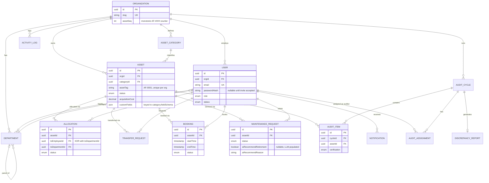

*(`TransferRequest`, `AuditAssignment`, `DiscrepancyReport`, `Notification`, `ActivityLog`, `AuthSession`, and `PasswordResetToken` exist in the real schema — [`prisma/schema.prisma`](./prisma/schema.prisma) is the full source of truth; this diagram keeps the core relationships readable rather than reproducing all 20 tables.)*

**Invariants Prisma's schema syntax can't express live in hand-written migration SQL, not just in application code** — the database is the actual enforcement layer, application checks are a fast-path UX nicety on top:

- `Allocation`: a partial unique index (`WHERE status = 'ACTIVE'`) makes double-allocation structurally impossible, not just checked-for.
- `Allocation`: a `CHECK` constraint enforces "exactly one of `toEmployeeId`/`toDepartmentId`" — never both, never neither.
- `Booking`: a GiST exclusion constraint (`EXCLUDE USING gist (assetId WITH =, tsrange(startTime, endTime, '[)') WITH &&)`) makes overlapping bookings for the same asset structurally impossible under concurrent writes — an app-layer "check then insert" would have a race window, this doesn't.
- `User`: a `CHECK` constraint enforces that any non-`PENDING_APPROVAL` user must have a password set.
- `AuditCycle`: a `CHECK` constraint enforces `endDate >= startDate` and "scope is at most one of department/location."

## Why these choices? (caching, search, indexing)

### Indexing

Every foreign key gets an explicit index — Postgres does **not** auto-index FK columns (only the referenced side gets one), so `@@index([xId])` is added by hand on every relation. Composite indexes are built to match actual query shape, equality filters first then the sort/range column last (e.g. `@@index([orgId, status, createdAt])` serves "filter by status within an org, sorted newest-first" as a single index scan, not two). `Asset` additionally carries a `pg_trgm` GIN index on `name` for fuzzy search when Meilisearch is the primary path but Postgres needs to answer directly, and `Allocation` has a **partial** index (`WHERE returnedAt IS NULL`) for the overdue-returns sweep — narrowing to only open allocations before the date comparison, since `now()` isn't `IMMUTABLE` and can't appear directly in an index predicate.

### Caching (Redis, cache-aside)

List endpoints (entity tables, the Reports dashboard) use a cache-aside pattern: check Redis first, and on a miss, query Postgres and populate the cache with a short TTL. Cache keys are composed from entity + role + page + limit + search + filters + sorts, so two different views never collide. **Redis is never authoritative** — every write path that could stale the cache invalidates the relevant key prefix immediately after the database commit, and every Redis read/write is wrapped so a down Redis instance just means "always a cache miss," never a broken response. This matters because a demo running with `docker compose up -d` might have Redis flake or not be started at all — the app should never notice.

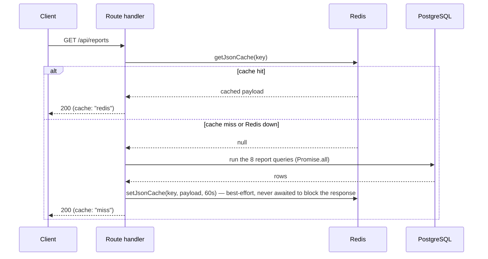

### Search (Meilisearch primary, Postgres fallback)

Meilisearch is the primary search provider for typo-tolerant, ranked results on list pages. Every write to a searchable entity fires a **fire-and-forget** `void upsertInSearch(...)` after the Postgres write commits — search consistency is eventual, and that's an accepted tradeoff, because search must never block or fail a mutation. Every search *read* goes through a helper that returns `null` on any Meilisearch error (timeout, network, non-2xx) rather than throwing, and the caller's defined fallback is a Postgres `ILIKE`/`pg_trgm` query — degraded (no typo tolerance, no relevance ranking) but functionally correct. A judge running this demo with Meilisearch simply not started will see search keep working, just less fuzzy.

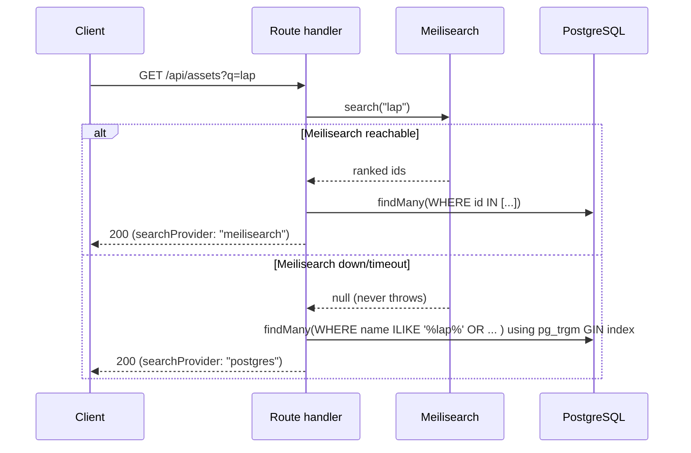

### Why UUIDv7 over auto-increment or UUIDv4

Sequential auto-increment IDs leak business volume (a competitor watching `/assets/1042` learns you have ~1000 assets) and are a worse fit for a multi-tenant system where IDs are handed to the client routinely. Random UUIDv4 solves the leak but destroys B-tree index locality (every insert lands in a random page, causing write amplification on a busy table). UUIDv7 keeps a time-ordered prefix (good index locality, sequential-ish inserts) while the remaining bits stay random (no volume leak, no collision risk) — the best fit for a schema with 20 actively-written tables.

## Stack

- **Framework**: Next.js 16 App Router, React 19, TypeScript strict mode (no `any`, no unchecked `!`).
- **UI**: Tailwind CSS 4 (CSS-first `@theme` config), Shadcn/Radix primitives, Lucide icons, Framer Motion for purposeful micro-interactions (gated behind `prefers-reduced-motion`).
- **Database**: PostgreSQL 15+, Prisma 6 (typed client, UUIDv7 primary keys as native `uuid` columns, hand-written migrations for constraints Prisma's schema syntax can't express).
- **Cache**: Redis for list-endpoint cache-aside, rate limiting, idempotency keys, and pub/sub for live notifications — every Redis failure degrades soft.
- **Search**: Meilisearch for typo-tolerant table search, with a Postgres `pg_trgm` fallback when it's unavailable.
- **Object storage**: S3-compatible (MinIO locally) for asset photos and documents; metadata and RBAC stay in Postgres.
- **Drag-and-drop**: `dnd-kit` for the Maintenance Kanban board.
- **Voice input**: native browser `SpeechRecognition`/`webkitSpeechRecognition`, no external dependency.
- **LLM**: one OpenAI-compatible proxy adapter (`lib/llm.ts`) with timeout/retry/circuit-breaker, used for the maintenance retirement recommendation — never called directly from a component.
- **Email**: Nodemailer, mock/console-logging mode when SMTP isn't configured.
- **Logging**: structured JSON to stdout, optional Loki push — never a bare `console.log`.
- **Validation**: Zod is the single source of truth for both runtime validation and inferred TypeScript types across every API boundary.

## Local setup

Prerequisites: Node 22+ (see `.nvmrc`), pnpm 10+ (pinned via `packageManager` in `package.json` — never `npm`/`yarn`), Docker Desktop or Docker Engine.

```bash
pnpm install
cp .env.example .env
docker compose up -d          # Postgres, Redis, Meilisearch, MinIO, Loki
pnpm db:migrate                 # apply the committed migration history
pnpm db:generate                 # regenerate the Prisma client
pnpm db:reset:populate           # wipe + seed a full demo dataset (see below)
pnpm dev
```

Open `http://localhost:3000`. Check `docker compose ps` before assuming a service is down; `lib/env.ts` validates required environment variables at process startup and will fail fast with a clear message if something's missing or malformed — read that message, don't guess.

Only `DATABASE_URL` is strictly required to boot. Redis, Meilisearch, MinIO/S3, the LLM provider, and Loki are all optional at runtime — see [Why these choices](#why-these-choices-caching-search-indexing) for exactly how each one degrades.

## Demo logins

`pnpm db:reset:populate` seeds one organization ("AssetFlow Demo Co") with a full spread of departments, categories, assets (mixed statuses), allocations, transfers, bookings, maintenance requests (across every kanban status), and two audit cycles (one closed, one in progress). Every active demo user shares the password **`Password123!`**:

| Email | Role |
| --- | --- |
| `admin@assetflow.demo` | Admin |
| `manager@assetflow.demo` / `manager2@assetflow.demo` | Asset Manager |
| `depthead@assetflow.demo` / `depthead2@assetflow.demo` | Department Head |
| `employee@assetflow.demo` … `employee5@assetflow.demo` | Employee |

`pending1@assetflow.demo` / `pending2@assetflow.demo` are seeded in `PENDING_APPROVAL` (no password set) to exercise the admin-approval flow.

## Day-to-day commands

```bash
pnpm dev                    # start the dev server
pnpm lint                    # ESLint — zero warnings expected before a commit
pnpm typecheck                # tsc --noEmit
pnpm build                    # production build — run before shipping anything routing/config-sensitive
pnpm db:migrate                # create + apply a new Prisma migration
pnpm db:generate                # regenerate the Prisma client after a schema change
pnpm db:reset:populate          # DESTRUCTIVE — wipes and reseeds the local DB; never run against a shared DB
pnpm template:seed              # reseed demo data without a full reset
pnpm search:index                # reindex Meilisearch after a direct DB write (bulk import, seed) that skipped the API
```

| Script | What it does |
| --- | --- |
| `pnpm dev` | Next.js dev server (Turbopack). |
| `pnpm build` | Production build. |
| `pnpm start` | Runs the built app with `next start`. |
| `pnpm lint` | ESLint. |
| `pnpm typecheck` | `tsc --noEmit`. |
| `pnpm db:migrate` | Prisma `migrate dev` — create/apply local migrations. |
| `pnpm db:generate` | Regenerates the Prisma client. |
| `pnpm db:reset` | Resets the DB from migration history. Destructive. |
| `pnpm db:reset:populate` | Reset + seed + search index in one step. Destructive. |
| `pnpm db:populate` | Generate users + seed + index, without a schema reset. |
| `pnpm template:seed` | Runs `scripts/seed-template-data.js` — the full AssetFlow demo dataset. |
| `pnpm template:refresh` | `template:seed` + `search:index`, non-destructive. |
| `pnpm search:index` | Rebuilds Meilisearch indexes for users/organizations/assets. |
| `pnpm users:generate` / `users:seed` / `users:populate` | Standalone user-only seeding utilities. |
| `pnpm db:wipe` / `db:wipe:table` | Wipe all tables / one table. Destructive, local only. |

Keep this table in sync with `package.json` — a script that isn't documented doesn't exist as far as DX is concerned.

## Project structure

```text
app/            Routes, layouts, route handlers, error/loading boundaries.
  api/          Route handlers only — no business logic lives in components.
  (protected)/  Route group requiring an authenticated session (app/(protected)/layout.tsx is the real authz boundary; proxy.ts is a cheap edge-level redirect for UX only).
components/
  ui/           Shadcn primitives — extend, don't fork.
  layout/       Navbar, footer, app chrome.
  forms/ modals/ tables/ pages/  Feature-organized, never dumped at components/ root.
hooks/          Client hooks: data sync, media queries, reusable stateful logic (e.g. useSpeechToText).
lib/            Server + shared utilities: prisma client, auth, api envelope, logger, search, Redis cache, LLM adapter, resilience (timeout/retry/circuit-breaker), query builders, env validation, rate limiting.
prisma/         schema.prisma + committed migration history — treat migrations as history, not a scratchpad.
scripts/        DX scripts: seeding, generation, wiping, indexing — run via pnpm, never as one-off inline commands.
types/          Shared Zod schemas and inferred types — the cross-cutting type source of truth.
docs/           Demo script, screenshots, design references.
```

## Security model

- Sessions are random opaque tokens, stored **hashed** (`sha256`); the raw token only ever exists in the `httpOnly` cookie and the response that sets it.
- Passwords are PBKDF2-SHA256 at 210,000 iterations with a per-user salt, verified with `timingSafeEqual`.
- Every protected page and API route re-verifies the session against the database — the edge proxy's cookie-presence check is a UX convenience only, never the authorization boundary.
- Role checks are always server-side, using the role loaded fresh from the DB in the current request — never a client-supplied field.
- Every multi-tenant table is scoped to the caller's `orgId` at the query layer (`EntityConfig.tenantScope` for the generic CRUD engine, explicit `where: { orgId }` everywhere else) — this is the top security invariant in a multi-tenant app and the first thing to check when adding a new table or route.

See `AGENTS.md` §6 for the full model.

## Manual quality gates

There are no automated tests or CI in this project. Before committing meaningful changes, run:

```bash
pnpm lint
pnpm typecheck
pnpm build
```

For UI work, also run `pnpm dev` and manually exercise the affected flow — golden path plus at least one edge case (empty/loading/error state) — in both light and dark mode, at mobile/tablet/desktop widths.
