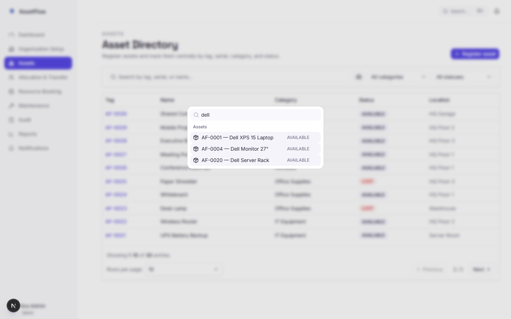
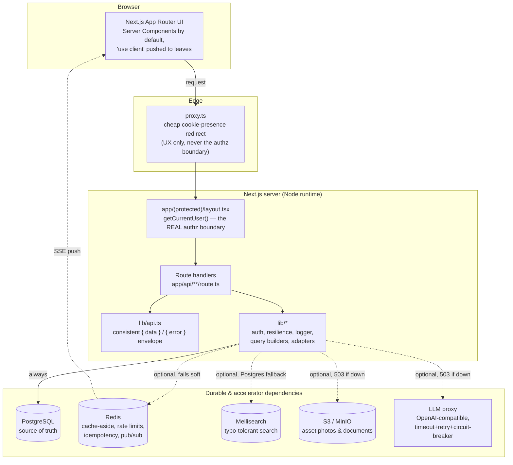
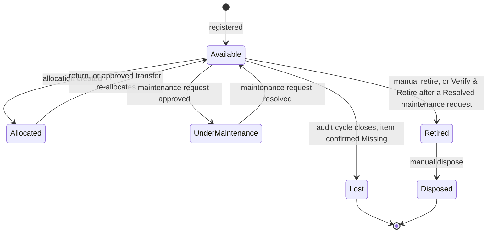
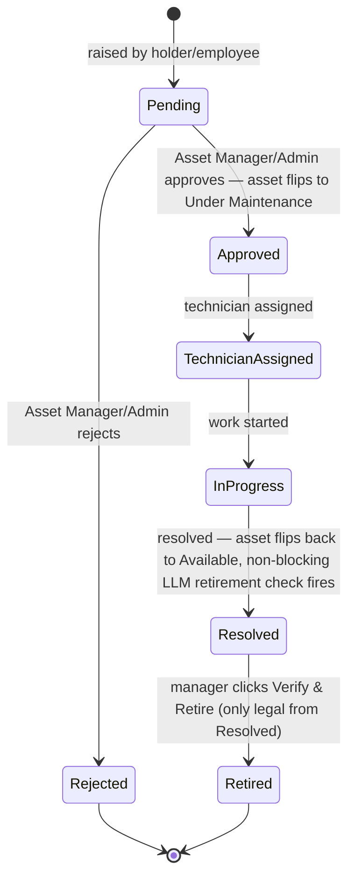
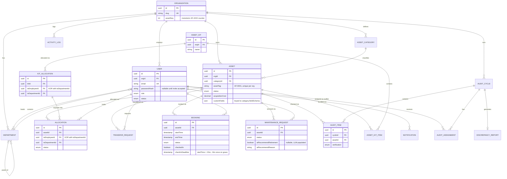
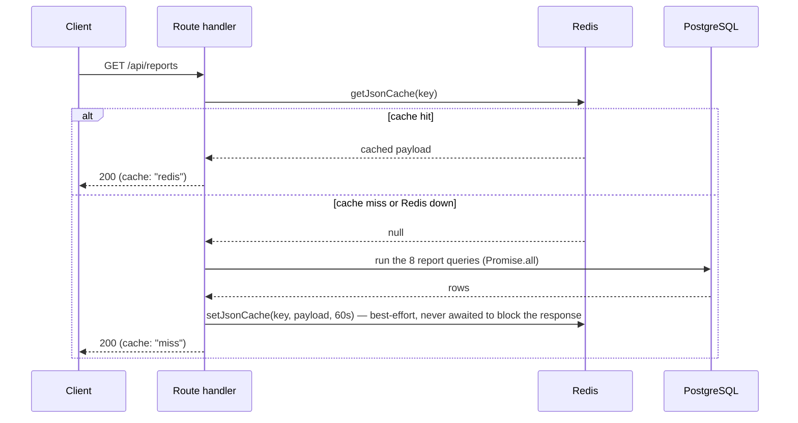
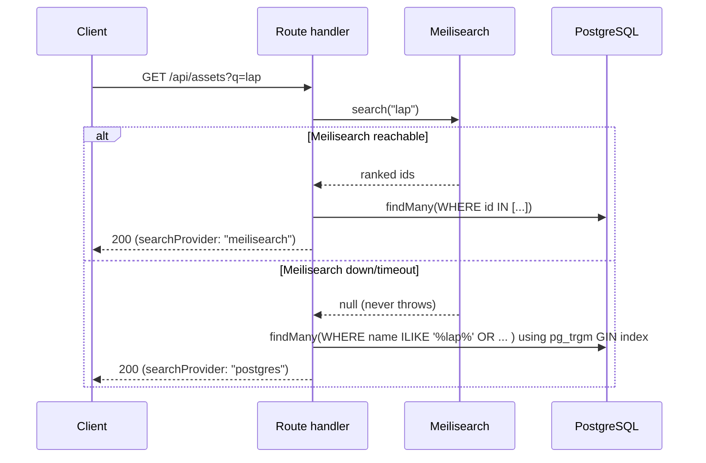

# AssetFlow

      

**AssetFlow** is an enterprise asset-management system: register and track physical assets (with QR-code lookup), allocate them individually or in bulk kits to employees or departments, resolve allocation conflicts through transfer requests, book shared resources on a conflict-free calendar with enforced check-in, run an AI-assisted maintenance workflow, audit inventory against expected holders, and report on utilization and spend — all behind real session auth and role-based access control.

Built on Next.js 16, Prisma 6, and PostgreSQL, with Redis, Meilisearch, and S3-compatible object storage baked in as optional accelerators (never hard dependencies). There is intentionally no CI/CD, no test runner, no Husky, no lint-staged, and no commitlint — this project is optimized for fast local iteration: run the app, click through it, and use `pnpm lint`, `pnpm typecheck`, and `pnpm build` as your manual quality gate before committing.

> **Demoing this?** See [`docs/demo-script.md`](./docs/demo-script.md) for a 6-minute, screen-recording-ready walkthrough of every screen and its edge cases.

## Table of contents

- [Screens](#screens)
- [Feature matrix — brief-mandated vs. team-added](#feature-matrix--brief-mandated-vs-team-added)
- [Role & permission matrix](#role--permission-matrix)
- [Architecture](#architecture)
- [Key workflows](#key-workflows)
- [Database design](#database-design)
- [Why these choices? (caching, search, indexing)](#why-these-choices-caching-search-indexing)
- [Stack](#stack)
- [Local setup](#local-setup)
- [Demo logins](#demo-logins)
- [Day-to-day commands](#day-to-day-commands)
- [Project structure](#project-structure)
- [Security model](#security-model)
- [Manual quality gates](#manual-quality-gates)

## Screens

| | |
| --- | --- |
|  **Asset Directory** — search, filter, and register assets with auto-generated tags. |  **Allocation & Transfer** — allocate to an employee or department; conflicts route straight into a transfer request. |
|  **Resource Booking** — day-timeline calendar with a live conflict preview before you submit. |  **Maintenance Kanban** — drag-and-drop board with AI retirement recommendations and a one-click Verify & Retire action. |
|  **Audit Cycles** — scope an audit, verify assets, auto-raise maintenance on damage. |  **Reports** — KPIs, charts, and compact-by-default tables with a Vercel-style expand toggle. |
|  **Admin** — role management, org-wide entity control. |  **Notifications** — live, categorized, pushed over SSE. |
|  **Fully responsive** — the Kanban board (the hardest layout to shrink) at 390px wide. |  **Users** — the generic entity-CRUD engine, reused across Users/Organizations/Departments. |
|  **Ctrl+K Global Search** — grouped, debounced, Meilisearch-backed results across assets/employees/departments/organizations, org-scoped inside the search index itself. | |

## Feature matrix — brief-mandated vs. team-added

Every row cites the actual mechanism and the file it lives in, not just a description — this is the "how it was engineered" reference, not a marketing list. **Source** is `Brief` for something the hackathon problem statement asked for, `Team` for something added beyond it.

| Area | Feature | Source | Engineering | Where |
| --- | --- | --- | --- | --- |
| Auth | Non-self-elevating accounts | Brief | Signup always lands in `PENDING_APPROVAL`; role promotion is a single ADMIN-only endpoint with a self-demotion guard | `app/api/users/[id]/{approve,role}/route.ts` |
| Auth | Session re-validation per request | Brief | `getCurrentUser()` re-checks a hashed token against Postgres on every protected request; the edge `proxy.ts` cookie check is UX-only | `app/(protected)/layout.tsx`, `lib/auth.ts` |
| Auth | Password security | Brief (implied) | PBKDF2-SHA256, 210,000 iterations, per-user salt, `timingSafeEqual` compare (no timing side-channel) | `lib/password.ts` |
| Org setup | Department hierarchy | Brief | Self-relation `parentDepartmentId`; edits cascade live into the asset and allocation picklists (live FK, never a cached name string) | `prisma/schema.prisma` |
| Org setup | Category-specific custom fields | Brief | JSON column on `Asset`, validated at write time against the category's declared field schema — no EAV table explosion | `app/api/assets/route.ts` |
| Assets | Auto-generated tags | Brief | Sequential `AF-####`, atomic `Organization.assetSeq` increment inside the create transaction — two concurrent registrations can't collide | `app/api/assets/route.ts` |
| Assets | Full-text + fuzzy search | Brief | Meilisearch primary (typo-tolerant), Postgres `pg_trgm` GIN-indexed fallback if Meilisearch is down | `lib/meilisearch.ts` |
| Assets | Camera QR scanning | **Team** — brief only asked for a QR *field*, not a scan workflow | `html5-qrcode` in-browser camera scan feeds the result straight into the search bar | Asset Directory search bar |
| Allocation | No double-allocation | Brief | Partial unique index `WHERE status = 'ACTIVE'` on `Allocation` — structurally impossible, not just app-checked | `prisma/schema.prisma` |
| Allocation | Transfer request workflow | Brief | `Requested → Approved/Rejected`, approval scoped to the current holder's department for a Department Head | `app/api/transfers/*` |
| Allocation | Asset Kits | **Team** — not in the brief at all | Bulk-allocate N assets to one holder atomically; every asset validated available up front, each still gets its own `Allocation` row linked to a batch `KitAllocation` | `app/api/kits/*` |
| Booking | No overlapping bookings | Brief | GiST exclusion constraint, half-open interval — a booking ending at `T` and one starting at `T` don't conflict | `prisma/schema.prisma` |
| Booking | Check-in deadline, grace period, auto-cancel | **Team** — brief only asked for a pre-slot reminder | 15-minute check-in deadline from start time, one 5-minute grace extension, then a CRON sweep auto-cancels and frees the resource | `lib/cron/booking-checkin-sweep.ts` |
| Maintenance | Kanban approval workflow | Brief | 5-stage FSM (`Pending → Approved → Technician Assigned → In Progress → Resolved`); asset status is a *derived side effect* of the card, never independently editable while a request is open | `app/api/maintenance/*` |
| Maintenance | AI retirement recommendation | **Team** — not in the brief | Non-blocking LLM call on resolve, wrapped in timeout/retry/circuit-breaker, evaluates cost + history; manager reviews and retires globally with one click | `lib/maintenance-retirement.ts`, `lib/resilience.ts` |
| Maintenance | Voice dictation | **Team** — not in the brief | One reusable Web Speech API hook + button, used on the issue description and return-condition notes, degrades gracefully without browser support | `hooks/use-speech-to-text.ts` |
| Audit | Discrepancy reports | Brief | Auto-raises a maintenance request on a confirmed Damaged item; Missing flips the asset to Lost; a frozen JSON snapshot is generated on close | `app/api/audit-cycles/[id]/close/route.ts` |
| Audit | Guarded cycle close | Brief (robustness requirement) | A guarded `updateMany` means two admins closing the same cycle concurrently can't double-apply the Lost/maintenance side effects | same file |
| Reports | Full analytics suite | Brief | Utilization by department, maintenance frequency, most-used/idle/near-retirement assets, booking heatmap, department allocation summary | `lib/reports/queries.ts` |
| Reports | Redis-cached, CSV export | Brief (implied "export") / Team (caching choice) | 60-second cache-aside TTL so the dashboard stays fast under load; every table exports to CSV regardless of collapsed/expanded state | `app/api/reports/route.ts` |
| Notifications | Real-time delivery | Brief (implied "get notified") | Server-sent events pushed via Redis pub/sub, backed by a durable Postgres row so nothing's lost if the client wasn't connected | `lib/notifications.ts`, `lib/redis-pubsub.ts` |
| Notifications | Activity log vs. personal inbox split | Brief | Two distinct concepts sharing one event pipeline: an immutable org-wide audit trail and a per-user read/unread inbox | `lib/activity-events.ts` |
| Search | Ctrl+K global command palette | **Team** — not in the brief | Debounced, grouped, keyboard-navigable search across assets/employees/departments/organizations; scoped to the caller's org *inside* the Meilisearch query itself, not just the Postgres follow-up, and to what the caller's role can already read | `app/api/search/route.ts`, `components/layout/global-search.tsx` |

## Role & permission matrix

`ADMIN` > `ASSET_MANAGER` (org-wide, assets/allocations/bookings/maintenance/reports) > `DEPARTMENT_HEAD` (own department only) > `EMPLOYEE` (self-service). Every check is server-side, re-derived from the database role on each request — never a client-supplied field.

| Capability | Admin | Asset Manager | Department Head | Employee |
| --- | --- | --- | --- | --- |
| Manage departments / categories / promote roles | ✅ | ❌ | ❌ | ❌ |
| Register / edit assets | ✅ | ✅ | ❌ | ❌ |
| Allocate assets & kits | ✅ | ✅ | ❌ | ❌ |
| Approve transfer requests | ✅ | ✅ | ✅ (own department only) | ❌ |
| Book shared resources | ✅ | ✅ | ✅ | ✅ |
| Raise maintenance requests | ✅ | ✅ | ✅ | ✅ |
| Approve / assign / resolve maintenance | ✅ | ✅ | ❌ | ❌ |
| Verify & retire an asset | ✅ | ✅ | ❌ | ❌ |
| Create & close audit cycles | ✅ | ✅ | ❌ | ❌ |
| View org-wide reports | ✅ | ✅ | ❌ | ❌ |
| View own allocations / bookings only | — | — | — | ✅ (default scope) |
| Invite / approve users | ✅ | ❌ | ❌ | ❌ |

## Architecture



**The one rule that matters most**: only Postgres is a hard dependency. Every other box in that diagram — Redis, Meilisearch, S3, the LLM — is an accelerator with an explicit degrade path (see [Why these choices](#why-these-choices-caching-search-indexing) below). `proxy.ts` runs on the Edge runtime and does a cheap cookie-presence check for a fast redirect; it is **never** trusted as the real authorization boundary — every protected page and API route re-verifies the session against the database on every request.

## Key workflows

The brief's problem statement leaves several state-machine edges genuinely ambiguous (e.g. "does resolving maintenance always return an asset to Available, or to its prior holder?"). These diagrams are the actual, as-built resolution of that ambiguity — not the inferred/open-question version, the real transition graph enforced by the route handlers.

### Asset lifecycle



**Resolved open questions from the brief, as actually implemented:**
- Resolving a maintenance request **always** returns the asset to `Available` — never to a prior holder. An asset already `Allocated` when a fault is reported keeps that allocation; maintenance is tracked against the asset independently, not by detaching it from its holder.
- `Reserved` is a status that exists on the `Booking` record (`Upcoming/Ongoing/Completed/Cancelled`), not on `Asset.status` — a bookable asset stays `Available` on its own record throughout its booking lifecycle. `Asset.status` and `Booking.status` are deliberately decoupled.
- A manual status transition (`PATCH /api/assets/:id`) is only legal from `Available` or a terminal state (`Retired`/`Disposed`) — `Allocated`/`UnderMaintenance`/`Lost` are only reachable as side effects of their own workflow endpoints, never a direct edit (`lib/assets.ts`, `MANUALLY_TRANSITIONABLE_ASSET_STATUSES`).

### Maintenance approval workflow



Rendered as a drag-and-drop Kanban board (`dnd-kit`) — a deliberate UI choice carried over from the mockup, not a simplification. An illegal drag (skipping a stage, or dragging backwards) is rejected client-side and the card snaps back; the drag only ever calls a route that enforces the same guarded transition server-side, so the client-side check is a UX nicety, not the actual guard.

## Database design

All 20 tables scoped under one multi-tenant root (`Organization`), including `AssetKit`/`AssetKitItem`/`KitAllocation` for bulk allocation. UUIDv7 primary keys everywhere (sortable-enough, collision-resistant, don't leak sequential volume like an auto-increment int would), stored as native Postgres `uuid` columns rather than `text` for smaller storage and faster index comparisons.



*(`TransferRequest`, `AuditAssignment`, `DiscrepancyReport`, `Notification`, `ActivityLog`, `AuthSession`, `PasswordResetToken`, and `AssetKitItem` exist in the real schema — [`prisma/schema.prisma`](./prisma/schema.prisma) is the full source of truth; this diagram keeps the core relationships readable rather than reproducing all 20 tables.)*

**Invariants Prisma's schema syntax can't express live in hand-written migration SQL, not just in application code** — the database is the actual enforcement layer, application checks are a fast-path UX nicety on top:

| Table | Mechanism | Guarantees |
| --- | --- | --- |
| `Allocation` | Partial unique index `WHERE status = 'ACTIVE'` | Double-allocation is structurally impossible, not just checked-for — `KitAllocation` reuses this exact constraint per asset, so a kit can't bypass it either |
| `Allocation` / `KitAllocation` | `CHECK` — exactly one of `toEmployeeId`/`toDepartmentId` | Never both, never neither, on both the single-asset and kit-batch-header rows |
| `Booking` | GiST exclusion constraint `EXCLUDE USING gist (assetId WITH =, tsrange(startTime, endTime, '[)') WITH &&)` | Overlapping bookings for the same asset are structurally impossible under concurrent writes — an app-layer "check then insert" has a race window, this doesn't |
| `User` | `CHECK` — non-`PENDING_APPROVAL` implies a password hash exists | An account can never reach `ACTIVE`/`INACTIVE` without a password set |
| `AuditCycle` | `CHECK` — `endDate >= startDate`, and scope is at most one of department/location | Temporal ordering and scope-exclusivity enforced before a row can ever exist |

## Why these choices? (caching, search, indexing)

### Indexing

Every foreign key gets an explicit index — Postgres does **not** auto-index FK columns (only the referenced side gets one), so `@@index([xId])` is added by hand on every relation. Composite indexes are built to match actual query shape, equality filters first then the sort/range column last (e.g. `@@index([orgId, status, createdAt])` serves "filter by status within an org, sorted newest-first" as a single index scan, not two). `Asset` additionally carries a `pg_trgm` GIN index on `name` for fuzzy search when Meilisearch is the primary path but Postgres needs to answer directly, and `Allocation` has a **partial** index (`WHERE returnedAt IS NULL`) for the overdue-returns sweep — narrowing to only open allocations before the date comparison, since `now()` isn't `IMMUTABLE` and can't appear directly in an index predicate.

### Caching (Redis, cache-aside)

List endpoints (entity tables, the Reports dashboard) use a cache-aside pattern: check Redis first, and on a miss, query Postgres and populate the cache with a short TTL. Cache keys are composed from entity + role + page + limit + search + filters + sorts, so two different views never collide. **Redis is never authoritative** — every write path that could stale the cache invalidates the relevant key prefix immediately after the database commit, and every Redis read/write is wrapped so a down Redis instance just means "always a cache miss," never a broken response. This matters because a demo running with `docker compose up -d` might have Redis flake or not be started at all — the app should never notice.



### Search (Meilisearch primary, Postgres fallback)

Meilisearch is the primary search provider for typo-tolerant, ranked results on list pages. Every write to a searchable entity fires a **fire-and-forget** `void upsertInSearch(...)` after the Postgres write commits — search consistency is eventual, and that's an accepted tradeoff, because search must never block or fail a mutation. Every search *read* goes through a helper that returns `null` on any Meilisearch error (timeout, network, non-2xx) rather than throwing, and the caller's defined fallback is a Postgres `ILIKE`/`pg_trgm` query — degraded (no typo tolerance, no relevance ranking) but functionally correct. A judge running this demo with Meilisearch simply not started will see search keep working, just less fuzzy.



### Why UUIDv7 over auto-increment or UUIDv4

Sequential auto-increment IDs leak business volume (a competitor watching `/assets/1042` learns you have ~1000 assets) and are a worse fit for a multi-tenant system where IDs are handed to the client routinely. Random UUIDv4 solves the leak but destroys B-tree index locality (every insert lands in a random page, causing write amplification on a busy table). UUIDv7 keeps a time-ordered prefix (good index locality, sequential-ish inserts) while the remaining bits stay random (no volume leak, no collision risk) — the best fit for a schema with 20 actively-written tables.

## Stack

| Layer | Choice | Notes |
| --- | --- | --- |
| Framework | Next.js 16 App Router, React 19 | TypeScript strict mode — no `any`, no unchecked `!` |
| UI | Tailwind CSS 4, Shadcn/Radix primitives, Lucide icons | Framer Motion for purposeful micro-interactions, gated behind `prefers-reduced-motion` |
| Database | PostgreSQL 15+, Prisma 6 | UUIDv7 primary keys as native `uuid` columns; hand-written migrations for constraints Prisma's schema syntax can't express |
| Cache | Redis | List-endpoint cache-aside, rate limiting, idempotency keys, pub/sub for live notifications — every failure degrades soft |
| Search | Meilisearch | Typo-tolerant table + Ctrl+K search, with a Postgres `pg_trgm` fallback when unavailable |
| Object storage | S3-compatible (MinIO locally) | Asset photos and documents; metadata and RBAC stay in Postgres |
| Drag-and-drop | `dnd-kit` | Maintenance Kanban board |
| QR scanning | `html5-qrcode` | Camera-based, in the Asset Directory search bar |
| Voice input | Native `SpeechRecognition`/`webkitSpeechRecognition` | No external dependency |
| LLM | One OpenAI-compatible proxy adapter (`lib/llm.ts`) | Timeout/retry/circuit-breaker; used for maintenance retirement recommendation; never called directly from a component |
| Email | Nodemailer | Mock/console-logging mode when SMTP isn't configured |
| Scheduled jobs | `node-cron` | Registered once per server process from `instrumentation.ts` — booking reminders, check-in enforcement, overdue-return sweeps; no separate worker deployment |
| Logging | Structured JSON to stdout | Optional Loki push — never a bare `console.log` |
| Validation | Zod | Single source of truth for both runtime validation and inferred TypeScript types across every API boundary |

## Local setup

Prerequisites: Node 22+ (see `.nvmrc`), pnpm 10+ (pinned via `packageManager` in `package.json` — never `npm`/`yarn`), Docker Desktop or Docker Engine.

```bash
pnpm install
cp .env.example .env
docker compose up -d          # Postgres, Redis, Meilisearch, MinIO, Loki
pnpm db:migrate                 # apply the committed migration history
pnpm db:generate                 # regenerate the Prisma client
pnpm db:reset:populate           # wipe + seed a full demo dataset (see below)
pnpm dev
```

Open `http://localhost:3000`. Check `docker compose ps` before assuming a service is down; `lib/env.ts` validates required environment variables at process startup and will fail fast with a clear message if something's missing or malformed — read that message, don't guess.

Only `DATABASE_URL` is strictly required to boot. Redis, Meilisearch, MinIO/S3, the LLM provider, and Loki are all optional at runtime — see [Why these choices](#why-these-choices-caching-search-indexing) for exactly how each one degrades.

## Demo logins

`pnpm db:reset:populate` seeds one organization ("AssetFlow Demo Co") with a full spread of departments, categories, assets (mixed statuses), allocations, transfers, bookings, maintenance requests (across every kanban status), and two audit cycles (one closed, one in progress). Every active demo user shares the password **`Password123!`**:

| Email | Role |
| --- | --- |
| `admin@assetflow.demo` | Admin |
| `manager@assetflow.demo` / `manager2@assetflow.demo` | Asset Manager |
| `depthead@assetflow.demo` / `depthead2@assetflow.demo` | Department Head |
| `employee@assetflow.demo` … `employee5@assetflow.demo` | Employee |

`pending1@assetflow.demo` / `pending2@assetflow.demo` are seeded in `PENDING_APPROVAL` (no password set) to exercise the admin-approval flow.

## Day-to-day commands

```bash
pnpm dev                    # start the dev server
pnpm lint                    # ESLint — zero warnings expected before a commit
pnpm typecheck                # tsc --noEmit
pnpm build                    # production build — run before shipping anything routing/config-sensitive
pnpm db:migrate                # create + apply a new Prisma migration
pnpm db:generate                # regenerate the Prisma client after a schema change
pnpm db:reset:populate          # DESTRUCTIVE — wipes and reseeds the local DB; never run against a shared DB
pnpm template:seed              # reseed demo data without a full reset
pnpm search:index                # reindex Meilisearch after a direct DB write (bulk import, seed) that skipped the API
```

| Script | What it does |
| --- | --- |
| `pnpm dev` | Next.js dev server (Turbopack). |
| `pnpm build` | Production build. |
| `pnpm start` | Runs the built app with `next start`. |
| `pnpm lint` | ESLint. |
| `pnpm typecheck` | `tsc --noEmit`. |
| `pnpm db:migrate` | Prisma `migrate dev` — create/apply local migrations. |
| `pnpm db:generate` | Regenerates the Prisma client. |
| `pnpm db:reset` | Resets the DB from migration history. Destructive. |
| `pnpm db:reset:populate` | Reset + seed + search index in one step. Destructive. |
| `pnpm db:populate` | Generate users + seed + index, without a schema reset. |
| `pnpm template:seed` | Runs `scripts/seed-template-data.js` — the full AssetFlow demo dataset. |
| `pnpm template:refresh` | `template:seed` + `search:index`, non-destructive. |
| `pnpm search:index` | Rebuilds Meilisearch indexes for users/organizations/assets. |
| `pnpm users:generate` / `users:seed` / `users:populate` | Standalone user-only seeding utilities. |
| `pnpm db:wipe` / `db:wipe:table` | Wipe all tables / one table. Destructive, local only. |

Keep this table in sync with `package.json` — a script that isn't documented doesn't exist as far as DX is concerned.

## Project structure

```text
app/            Routes, layouts, route handlers, error/loading boundaries.
  api/          Route handlers only — no business logic lives in components.
  (public)/     Landing, login, signup, forgot/reset password — Navbar + Footer chrome.
  (protected)/  Route group requiring an authenticated session (app/(protected)/layout.tsx is the real authz boundary AND owns the sidebar app shell; proxy.ts is a cheap edge-level redirect for UX only).
components/
  ui/           Shadcn primitives — extend, don't fork.
  layout/       Sidebar (primary nav for authenticated screens) + AppTopbar (search/notifications) for (protected)/; Navbar + Footer for (public)/.
  forms/ modals/ tables/ pages/  Feature-organized, never dumped at components/ root.
hooks/          Client hooks: data sync, media queries, reusable stateful logic (e.g. useSpeechToText).
lib/            Server + shared utilities: prisma client, auth, api envelope, logger, search, Redis cache, LLM adapter, resilience (timeout/retry/circuit-breaker), query builders, env validation, rate limiting.
prisma/         schema.prisma + committed migration history — treat migrations as history, not a scratchpad.
scripts/        DX scripts: seeding, generation, wiping, indexing — run via pnpm, never as one-off inline commands.
types/          Shared Zod schemas and inferred types — the cross-cutting type source of truth.
docs/           Demo script, screenshots, design references.
```

## Security model

| Control | Mechanism |
| --- | --- |
| Session tokens | Random opaque tokens, stored **hashed** (`sha256`) — the raw token only ever exists in the `httpOnly` cookie and the response that sets it |
| Passwords | PBKDF2-SHA256, 210,000 iterations, per-user salt, verified with `timingSafeEqual` (no timing side-channel) |
| Route protection | Every protected page and API route re-verifies the session against the database — the edge proxy's cookie-presence check is UX only, never the authorization boundary |
| Role checks | Always server-side, using the role loaded fresh from the DB on the current request — never a client-supplied field |
| Multi-tenancy | Every tenant-scoped table filters on the caller's `orgId` at the query layer (`EntityConfig.tenantScope` for the generic CRUD engine, explicit `where: { orgId }` everywhere else) — the top security invariant in this app, and the first thing to check when adding a new table or route |
| Cache-key isolation | Redis cache keys include `orgId` (and role, where results vary by role) so two tenants' identical-shaped queries can never collide on the same cache entry |
| Search isolation | Meilisearch queries filter on `orgId` inside the search index itself, not just in the Postgres follow-up — prevents one tenant's results from crowding another's out of a shared top-N cutoff |
| Rate limiting | Unauthenticated, state-changing endpoints (login, signup, forgot-password, reset-password) are rate-limited per IP+route; authenticated account actions (password change) are rate-limited per user, not per IP, so a stolen session can't be brute-forced by rotating source IP |

See `AGENTS.md` §6 for the full model.

## Manual quality gates

There are no automated tests or CI in this project. Before committing meaningful changes, run:

```bash
pnpm lint
pnpm typecheck
pnpm build
```

For UI work, also run `pnpm dev` and manually exercise the affected flow — golden path plus at least one edge case (empty/loading/error state) — in both light and dark mode, at mobile/tablet/desktop widths.
